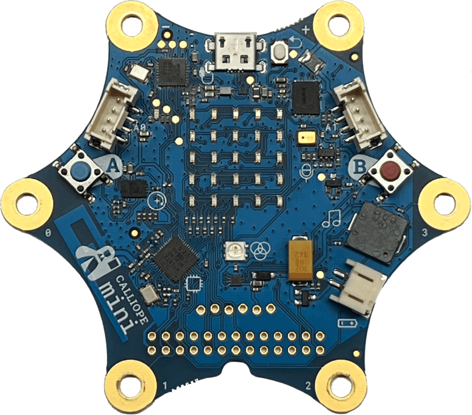
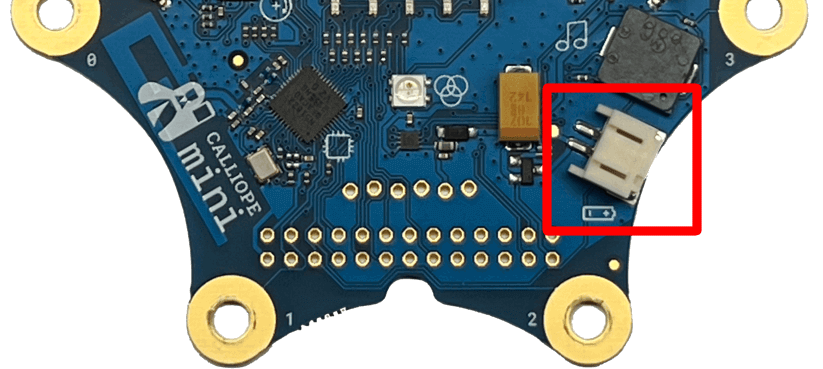
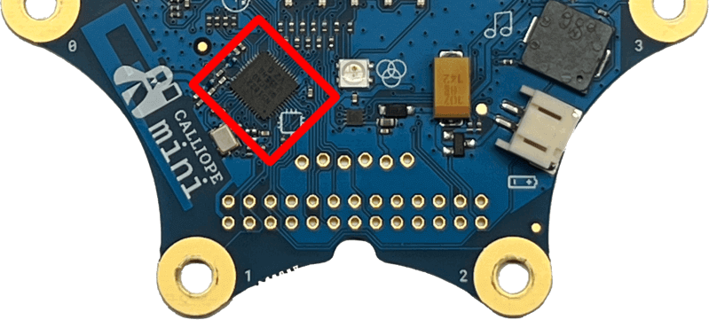
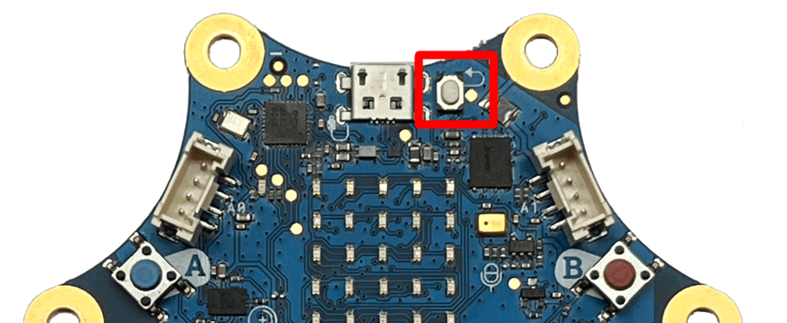
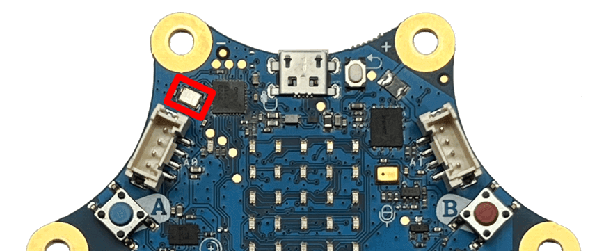
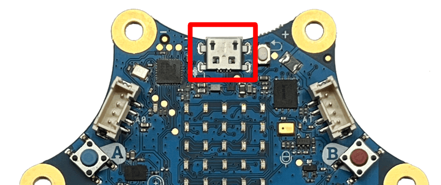

# Calliope Mini

The [Calliope mini][calliope-mini] is a single-board computer which was inspired by the [BBC miro:bit][micro-bit] and was developed for educational usage at German primary schools.

The name "Calliope mini" is a reference to [Calliope][calliope], a daughter of Zeus and the muse who presides over eloquence, science and epic poetry.

- **System**
  - [Battery Port](#battery-port)
  - [Processor](#processor)
  - [Reset_button](#reset-button)
  - [Status Led](#status-led)
  - [USB Port](#usb-port)

- **Input**
  - [Buttons](#buttons) 🚧
  - [Toch Pins](#touch_pins) 🚧

- **Actuator**
  - [5x5 LED Matrix](#lcd_screen) 🚧
  - [RGB_led](#rgb_led) 🚧
  - [Speaker](#speaker) 🚧

- **Sensors**
  - [Bluetooth](#bluetooth) 🚧
  - [Compass](#compass) 🚧
  - [Light Sensor](#light_sensor) 🚧
  - [Microphone](#microphone) 🚧
  - [Motion Sensor](#motion_sensor) 🚧
  - [Radio](#radio) 🚧
  - [Temperature Sensor](#temperature_sensor) 🚧
  
- **Extension Ports**
  - [Grove Adapter](#grove_adapter) 🚧
  - [Motor Pins](#motor_pins) 🚧
  - [GPIO Pins](#gpio_pins) 🚧

## System

### Battery Port

The battery port allows you to connect a battery pack or battery box with exact 3V.
This allows you do use the board mobile without any USB cable for the needed power like in a robot or a automated car.

### Processor

The processor is the brain of the board and is handling all of the functions of the boards and your program.
The most common one is a 32-bit ARM Cortex M0 processor with 16MHz.
Which is powerful enough for most simple tasks but not for very advances stuff.
In comparison most mobile phones have processor with about 2Ghz (2000Mhz) and computers up to 4,8Ghz (48000Mhz).

### Reset Button

The reset button allows you to reset your board and to re-start all actors and sensors.

### Status LED

The status LED of the board tells you the current status.

### USB Port

The usb port is used for transfer your own programs to the board over a micro-USB cable.
It will be also use as power source, so you could connect any suitable battery pack as an alternative to the batter port.

[micro-bit]: https://microbit.org/
[calliope]: https://en.wikipedia.org/wiki/Calliope
[calliope-mini]: https://calliope.cc/en
