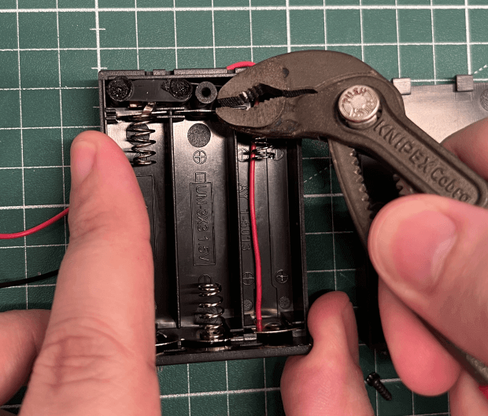
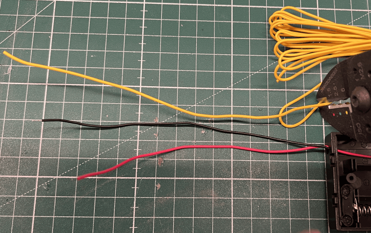
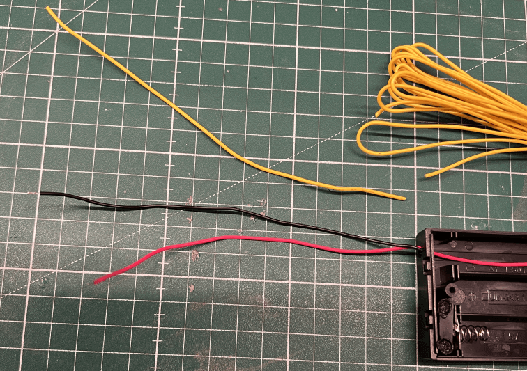
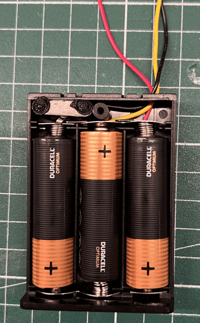
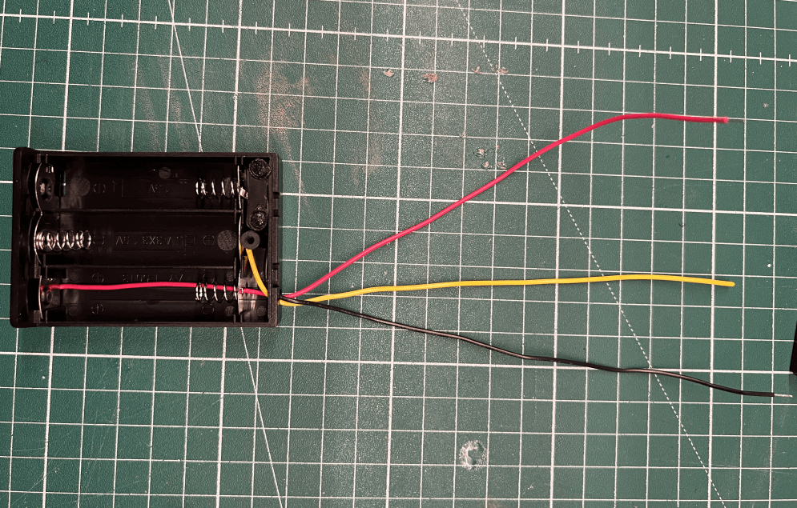

# Battery Box with 3V and 4.5V power

This tutorial covers the basic to create a battery box which is able to provide 3V and 4.5V over a single battery box at the same time which covers most of the normal use cases.

**Note: Keep in mind this is a good and easy solution for prototyping or testing projects, but for a more professional usage you should use a voltage converter instead.**

## Requirements

For this project we require some hardware components and hand tools.

### Hardware Components

The following hardware components are required for this project.

| Name                                                   | Quantity |
| ------------------------------------------------------ | -------- |
| Battery Box for 3 batteries (with or without a switch) | x 1      |
| Yellow Solid Wire (24 AWG / ~20cm)                     | x 1      |

### Hand tools

The following hand tools are needed.

| Name                      | Quantity |
| ------------------------- | -------- |
| Soldering Iron            | x 1      |
| Cable pliers or cutter    | x 1      |
| Small pliers              | x 1      |
| Bigger pliers or 3rd hand | x 1      |

## Story

More advances projects requires at least two different kind of voltages to work correctly like 3V and 4.5V.
The 3V is needed for the Calliope Mini itself and the 4.5V or higher is needed for other actors and sensors like stepper motors, ultrasonic sensors or other motors.

For this reason I looked for an easy and simple solution which allows me to simplify my prototyping with the Calliope Mini.

### Technical Background

Batteries and other power sources could be connected in series and/or in parallel.
By connecting the batteries in series we are able to increase the voltage with the same amount of current.

This allows us to get different kind of voltages on different places like:

- 1 x Battery = ~1.5V
- 2 x Batteries = ~3.0V
- 3 x Batteries = ~4.5V

All of these different kind of voltages sharing the same ground, this allows us to connect 3V and 4,5v components without an additional ground cable.

### 1. Open the battery box and remove the battery clip

Place the battery box on a solid ground.

The first step is to open the battery box, it's helpful if the battery box has a switch, but it's not needed. It could be that your battery box will look different but the function is mostly the same regardless of the brand.

After the battery box is open, use a small pliers to remove the battery clip between the second and third battery.

Make sure to remember the correct orientation of the battery clip before moving to the next step.

### 2. Cut the yellow wire in size an remove the isolation

As next step, check the size for the yellow wire. It should be a little bit longer than the existing wires to have some playroom later.

If you found the correct size, cut the wire with a wire cutter or cutter.

To be able to solder the wire we need to strip the wire with a cutter.

### 3. Solder the yellow wire to the battery clip

In the next step we are soldering the yellow wire to the battery clip.
Please make sure that you have a solid underground for the soldering in this step.

You can fix the battery clip with a bigger pliers or a 3rd hand.

Before we solder the wire and battery clip, you should pre-heat the battery clip and the wire to make sure that they have not any weird coating.
In the case they have any coating, use sandpaper and clean the soldering area to make it more sticky.

After the short pre-heating we could start soldering the battery clip and the wire.

Let the battery clip and wire cool down a little bit and make sure it has a strong connection.

### 4. Put the battery clip back to the battery box

After this we put the new wire trough the battery box, in most cases you can use the existing hole of the existing cables.

If everything is in place, press gently down the battery clip back in it's original place.

### 5. Place batteries and measure the voltage between the wires

In the last step we place the batteries (in the correct order) in the battery box and measure the voltage between the three wires.

We first start with the measurement between the black and red wire which should be around ~4.5V.

After this we measure the voltage between the black and yellow wire which should be around ~3.0V.

### 6. Trim/Strip wire and put back the battery cover

If everything looks fine, trim/strip the wires (without batteries).

Finally, put back the battery box cover and your modified battery box is ready to use.

### Done

You successfully build a battery box which could power your Calliope Mini with 3V over the black and yellow wire and other actors / sensors over the black and red wire with 4.5V.
