# Battery Box with 3V and 4.5V power and Connectors

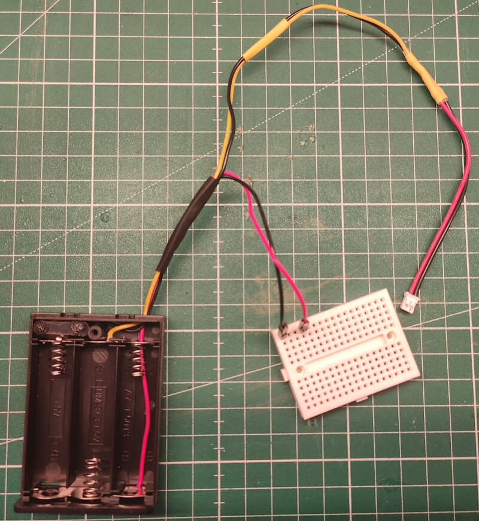

This tutorial covers the basic to create a advanced battery box which is able to provide 3V and 4.5V over a single battery box at the same time with the corresponding connectors which covers most of the normal use cases.

**Note: Keep in mind this is a good and easy solution for prototyping or testing projects, but for a more professional usage you should use a voltage converter instead.**

## Requirements

For this project is a modification for the [Battery Box](../battery_box/README.md) and requires some additional hardware components and hand tools.

### Hardware Components

The following hardware components are required for this project.

| Name                                                               | Quantity |
| ------------------------------------------------------------------ | -------- |
| Modified Battery Box (see [Battery Box](../battery_box/README.md)) | x 1      |
| Black Solid Wire (24 AWG / ~18cm)                                  | x 1      |
| Dupont male square connector (2.54 mm)                             | x 2      |
| Micro JST PH 2.0 2-Pin Connector                                   | x 1      |
| Solder Seal Wire Connector (26-24 AWG)                             | x 3      |
| Shrink Tube - black                                                | x 1      |
| Shrink Tube - yellow                                               | x 1      |

### Hand tools

The following hand tools are needed.

| Name                                                 | Quantity |
| ---------------------------------------------------- | -------- |
| Hot Air Gun (min. 200°-300° / Lighter will not work) | x 1      |
| Cable pliers or cutter                               | x 1      |
| Small pliers                                         | x 1      |
| Crimping tool                                        | x 1      |

## Story

The [Battery Box](../battery_box/README.md) is ideal for prototyping, but for kids or less advanced users it could be complicated to connect the correct wires.

For this reason I looked for any more bullet proofed solution which helps to avoid the common mistakes.

### 1. Open the battery box

Removing the cover from the battery box will help to test the new connection and makes the box lightweight.

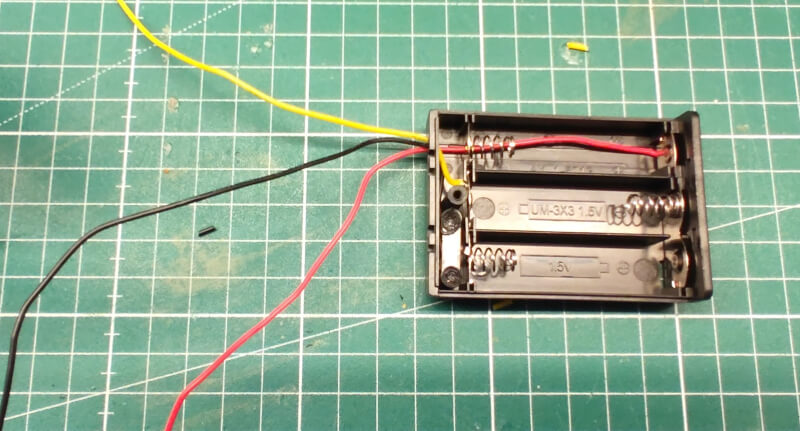

### 2. Cut the black wire and remove the isolation

You should cut the wire about 5cm-6cm away from the box, we will re-use the loose cropped part in the next step.

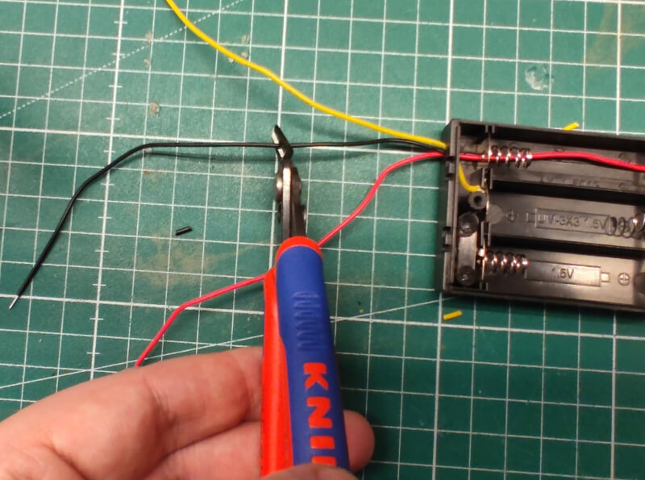

Remove the isolation from both cuts, before moving to the next steps.

### 3. Prepare black solid wire and use solder seal wire connector

First you should twirl the loose cropped part with the 18cm black solid wire, it doesn't need to be a strong connection.

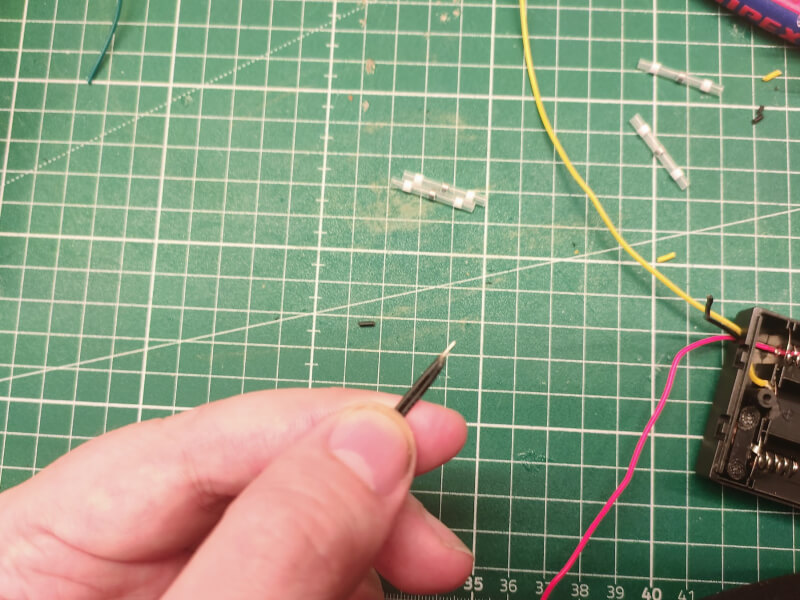

After this step put the loose prepared black solid wire and the remaining black wire from the battery box in the solder seal wire connector.

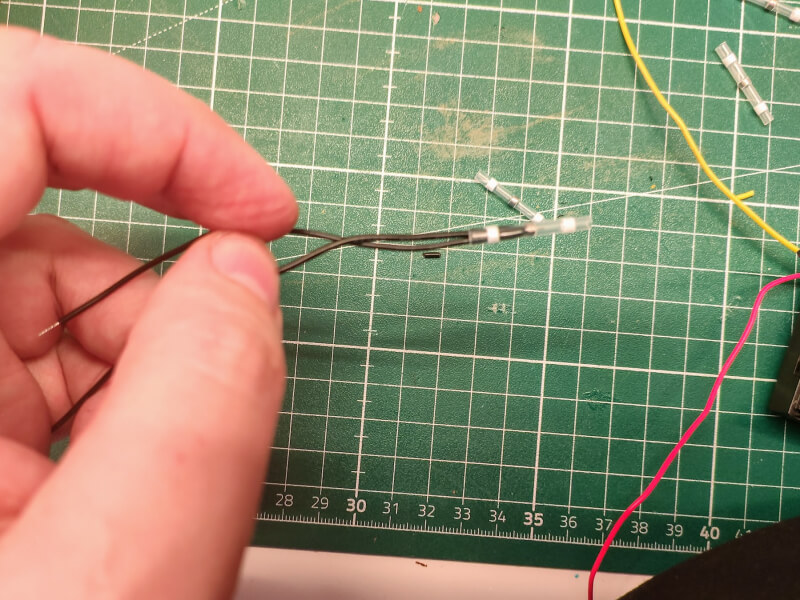

The stripped wires should meet in the middle inside the solder ring.

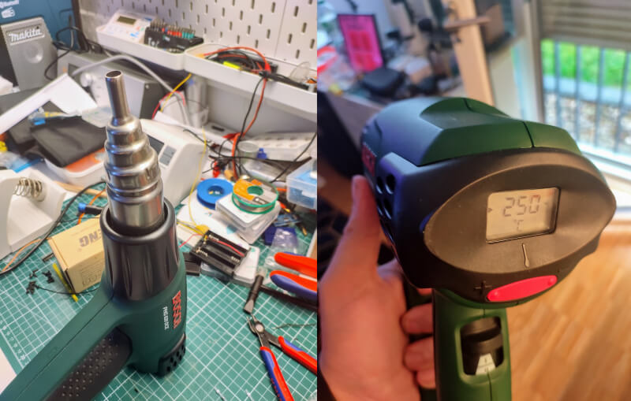

If possible place the heat gun on the table and make sure that nothing is inside the hot air stream (top and side).
The ideal temperature depends on the used solder seal wire connector but it mostly between 200°-300°.

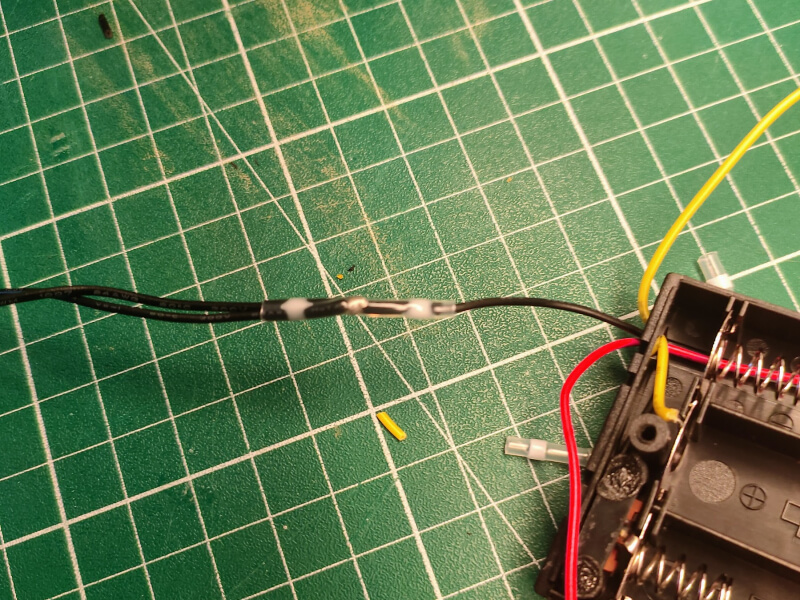

Make sure to hold the cables in place and start with the sides of the shrinking tube to fixate the cables, before going to the solder core in the middle.

### 4. Test the connection and use the black shrink tube

Before we move on, we need to make sure the connection works fine.
Use a multimeter to test the connection from the battery box to the two ends of the cables.

If everything looks fine, use the black shrink tube around all cables to give a little bit more stability to the construction.

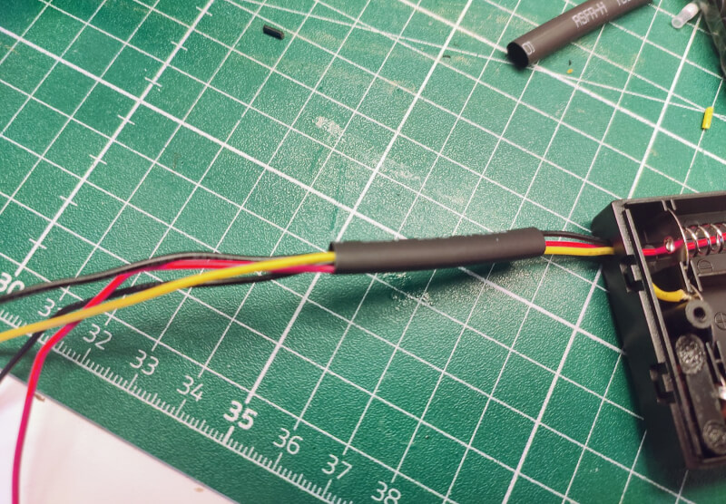

### 5. Place the yellow shrink tube around the long black and yellow wire

In some cases its useful to put shrink tubes around cables before soldering or connection them.
For this reason we need to cut the yellow shrink tube in half and put it around the long black and yellow wire.

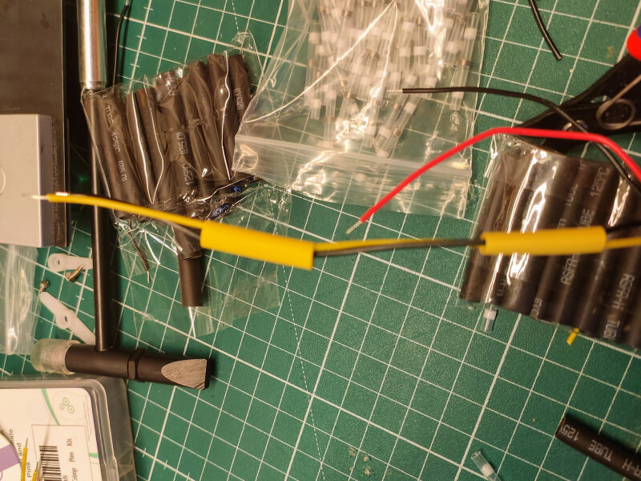

Note: The shrink tube should not be shrink yet!

### 6. Use solder seal wire connector to connect the Micro JST PH 2.0 2-Pin Connector

In this steps we are using the seal wire connector to connect the micro JST PH 2.0 2-Pin connector with the long black and yellow wire.

Please make sure that you connect the yellow wire to the red wire of the JST PH 2.0 2-Pin connector and the black wire to the black wire of the JST PH 2.0 2-Pin connector.

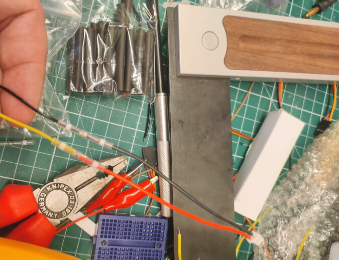

### 7. Test the connection and shrink the yellow shrink tube

Test your connection and if everything looks fine shrink the yellow shrink tube around the solder seal wire connector and above to give the cable a little bit more stability.

### 8. Use the crimping tool and the dupont male square connector

In the last step you need to use your crimping tool to mount the dupont male square connector to the remaining red and black wire from the battery box.

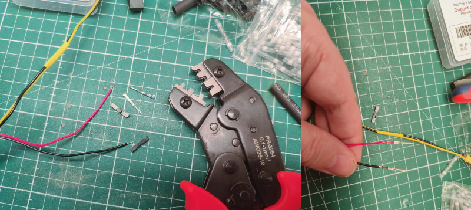

### 9. Test the connection

It's maybe sound boring but you should test the connection for all of your cables to make sure that you have no broken connection or an twisted connection which could lead to a short circuit.

### Done

You successfully build a battery box which could power your Calliope Mini with 3V over the JST PH 2.0 2-Pin connector and other actors / sensors over the black and red dupont male square connector with 4.5V.

