# Micro Servo SG90

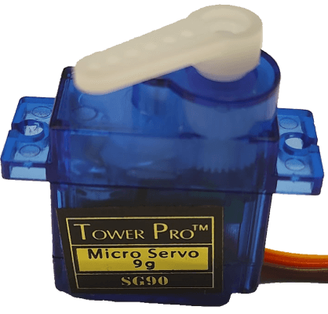

This tutorial covers the basic to connect and use the micro servo SG90 with a Calliope Mini together with the [Open Roberta Lab][open_roberta_lab].

## Requirements

For this project we require some hardware components.

### Hardware Components

The following hardware components are required for this project.

| Name                                                                                         | Quantity |
| -------------------------------------------------------------------------------------------- | -------- |
| Micro Servo SG90                                                                             | x 1      |
| 4.5V-5V power source like the [Battery Box with 3V and 4.5V power](../battery_box/README.md) | x 1      |
| Jump wire female-male or male-alligator in different colors                                  | x 2      |
| Jump wire male-male                                                                          | x 4      |
| Optional: Two row pin header (2mm distance, 5 x 2)                                           | x 1      |
| Optional: Breadboard with additional jump wire                                               | x 1      |

## Story

To connect a servo to the Calliope Mini, the most common way is to use an extra board with an additional power source or the A1 port with are slightly higher voltage.
In most cases the onboard power with 3V is to less to really drive the servo accurate or with enough power.

For this reason I looked for an easy and simple solution to connect one to three servos to the Calliope Mini over the existing pins instead.

### Technical Background

The servo has 3 connection pins like:

- **VCC** - Typical red cable for the voltage 3.3V - 5V
- **GND** - Typical brown/black cable for the ground
- **SIGNAL** - Typical orange/yellow cable for the signal

In most cases the servo will not really work with 3.3V or depending on the servo very very slow.
You should at least provide 4.5V or even 5V is the servo needs to be very accurate.

#### How does is work ?

By sending a pulse signal (within 20ms time frames) you can tell the servo to change the position between 0° to 180°.

Basic Example:

- Sending a pulse signal for <1ms servo will go to 0°
- Sending a pulse signal for 1,5ms servo will go to 90°
- Sending a pulse signal for >2ms servo will go to 180°

The servo itself is a basic motor, but with an position sensor, so the servo know when it has reached a specific position.
There are also servos which support a full 360° range, these are mostly use as wheels for moving robots.

### 1. Trim the servo

First of all before we could use the servo, we need to trim the servo to make sure it has the correct position for our use-case.

Make sure that the servo is not connected to any power source.
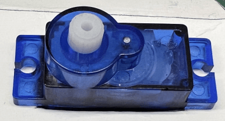

Look for the corresponding **servo horn** and place it lossy on the servo.
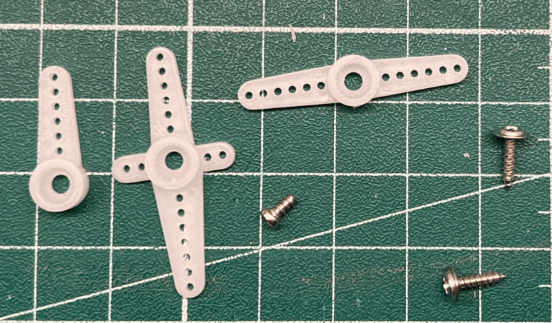

Turn the **servo horn** gently in one direction until it get's blocked / stopped.
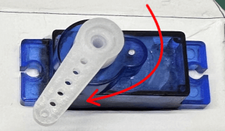

Re-position / re-attach the **servo horn** to mark the end position.
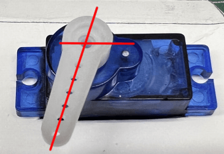

Turn the **servo horn** gently in the other direction until it get's blocked / stopped.
Check if the other end position looks fine, if not repeat the steps until the **servo horn** has the correct end stops.

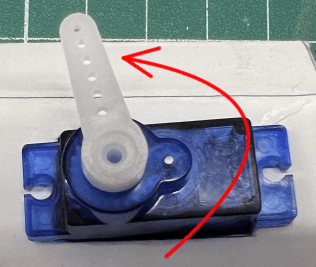

If everything looks fine, fixate the **servo horn** with the screw.
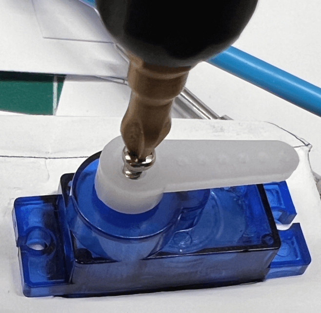

### 2. Prepare the Pin for the Signal, VCC and GND

The Signal pin requires a analog signal, this means we are limited in the possible pins we could use.

Recommended pins (basic):

- **P1 / C1**
- **P2 / C2**

Recommended pins (advanced):

- **C04**
- **C05**
- C06

Valid pins:

- P1 / C1 (touch)
- P2 / C2 (touch)
- A1
- C16 (RX)
- C17 (TX)

If not already installed use the two row pin header (5 x 2) to cover the pins C0 - C9.

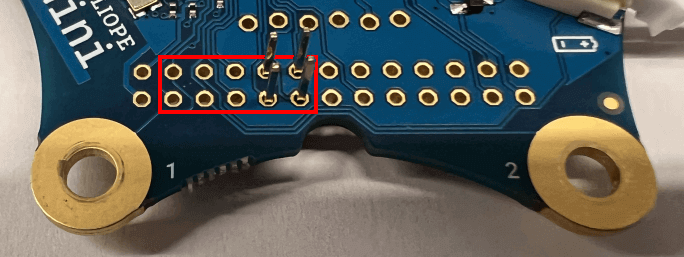

If you only want to use the servo and no other sensors together with alligator jump wire, you should use the **P1 / C1** pin.

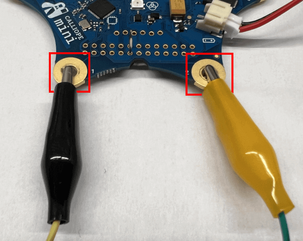

We recommend to use the pin **P1 / C1** or **C04** for the signal pin.

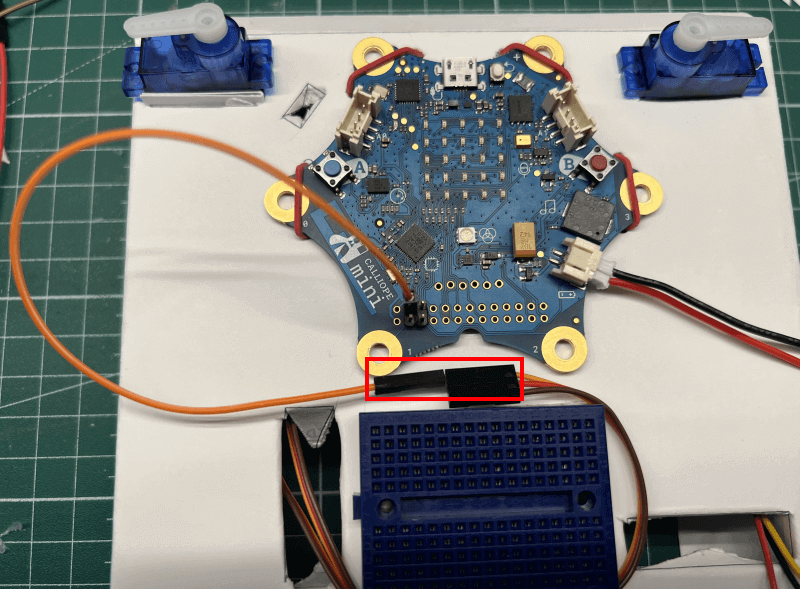

#### VCC (Voltage) Pin and GND (Ground) Pin

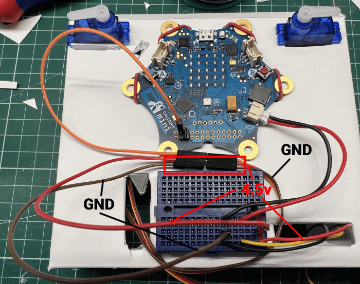

### 3. Pin Configuration for Signal pin

Before we could start using the servo, we first need to configure it inside the **robot configuration** tab.

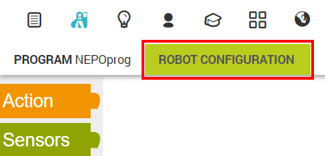

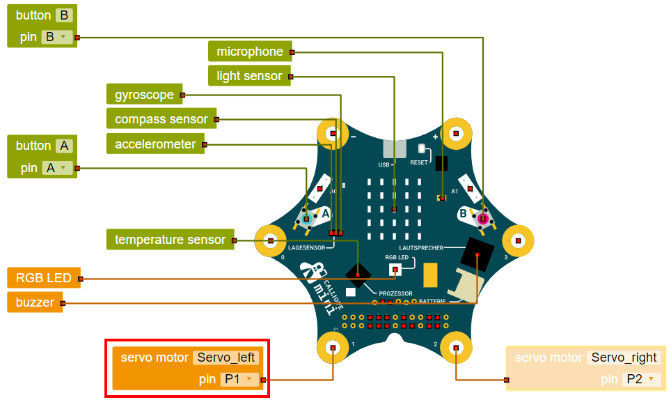

#### Signal Pin configuration

For the signal pin you need to use the **servo motor block** from the **Action section**.

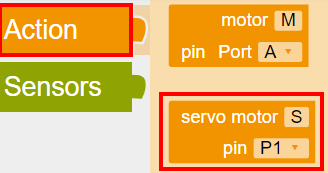

Move the block to the Calliope Mini and change the port to **P1 / C1** or the port you have chosen for your project.

### 4. Example Program

In the last step we are writing a small program which will move the servo depending on the pressed buttons A and B.

#### a.) Reset the servo to this start position

In the first step we are resetting the servo to the position 90°.
Use the **set servo motor block** from the **Action -> Move section** which has already a default value of 90°.

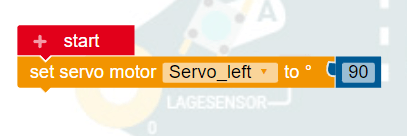

#### b.) Add a infinite loop

To check the press buttons we need to read the button state several time. The easiest way is to add an the repeat **indefinitely block** from the **Control section** to repeat the same actions over and over again.

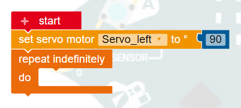

#### c.) Add a if ... do ... block

In the next step we are adding a **if do block** from the **Control -> Decision section** to define the checks for the buttons.

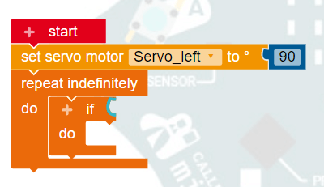

#### d.) Change the servo position based on the pressed A + B button

In the first condition we are checking if the **A and B buttons** are pressed at the same time, if yes we resetting the servo to 90°.

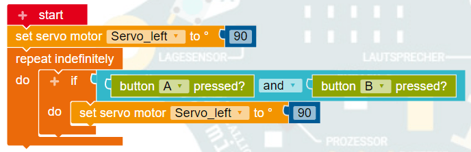

#### e.) Change the servo position based on the pressed A button

The second condition checks if only the **A button** is pressed, if yes we are moving the servo to 0°.

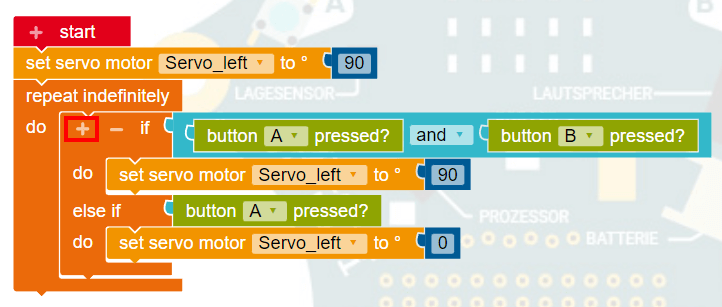

#### f.) Change the servo position based on the pressed B button

The last condition checks if only the **B button** is pressed, if yes we are moving the servo to 180°.

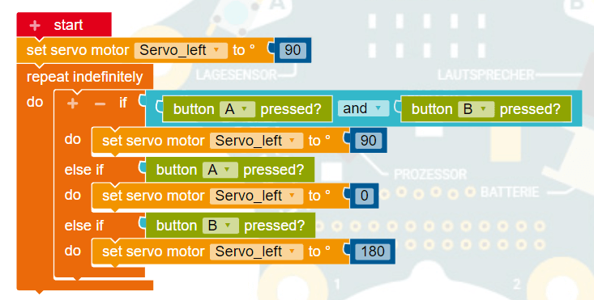

### Done

You successfully connected a servo to your Calliope Mini and can control it over the A and B button.

[open_roberta_lab]: https://lab.open-roberta.org/
