# Ultrasonic HC-SR04 Sensor

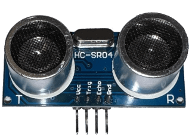

This tutorial covers the basic to connect and use the ultrasonic hc-sr04 sensor to a Calliope Mini together with the [Open Roberta Lab][open_roberta_lab].

## Requirements

For this project we require some hardware components.

### Hardware Components

The following hardware components are required for this project.

| Name                                                                                         | Quantity |
| -------------------------------------------------------------------------------------------- | -------- |
| Ultrasonic HC-SR04 Sensor                                                                    | x 1      |
| 4.5V-5V power source like the [Battery Box with 3V and 4.5V power](../battery_box/README.md) | x 1      |
| Jump wire female-female or female-alligator in different colors                              | x 4      |
| Optional: Two row pin header (2mm distance, 5 x 2)                                           | x 1      |
| Optional: Breadboard with additional jump wire                                               | x 1      |

## Story

The official supported Grove - Ultrasonic Ranger sensor works fine for most use cases, but unfortunately it's blocking the A1 port and is additional not easy to get in most regions.

For this reason I looked for an easy and simple solution to connect the more common ultrasonic hc-sr04 sensor to the Calliope Mini over the existing pins instead.

### Technical Background

The ultrasonic sensor has 4 connection pins like:

- **VCC** - Voltage 3.3V - 5.5V (recommended 5V with 10% tolerance)
- **Trig** - Trigger the ultrasonic burst. Set this pin to HIGH for 10µs, to trigger an ultrasonic burst (unique 8 pulse pattern).
- **Echo** - Received ultrasonic pulse. This pin will be HIGH after sending out a ultrasonic pulse and will go LOW after receiving the ultrasonic burst echo.
- **GND** - Ground

In most cases the ultrasonic sensor will work with 3.3V, but far less accurate.
If you need more accurate results within 3mm ranges you should make sure to provide 4.5V or exact 5.0V instead.

#### How does is work ?

By setting the **Trig pin** to **HIGH** for _10µs (microseconds)_ the ultrasonic sensor will send a ultrasonic burst with an unique 8 pulse pattern.

This unique 8 pulse pattern makes sure that you can use several ultrasonic sensors at once and that the signals are not colliding with each other.

If the sensor receiving the ultrasonic burst it will set the **Echo pin** to **LOW**.
Otherwise the **Echo pin** will set to LOW after a _38ms timeout_ instead.

By measuring the time between the sending out of the ultrasonic burst and the received echo, we could calculate the distance between the ultrasonic sensor and the reflecting object.

```math
Distance = Speed * Time
```

First need to use the travel speed of ultrasonic waves in air which is 343,2 m/second and converting it to centimeters per microseconds.
Because the signals travels forwards and backwards we need additional to use it two times with results in about ~58cm/µs.

```math
Ultra sonic travel speed = 2 * (343,2m/sec) / 10000
```

To get the distance in centimeter we just used the measures time between Trig and Echo and multiply it with 58cm/µs.

```math
Distance (cm) = 58cm/µs * Time
```

### 1. Prepare the Pins for Trig, Echo, VCC and GND

The Trig and Echo pin requires a digital signal, this means we you should try to avoid to use any analog, touch or other special pins to allow to use them for other sensors or actors which requires them.

Recommended pins (basic):

- **P0 / C0**
- **P3 / C3**

Recommended pins (advanced):

- C04
- C05
- C06
- C07
- **C08**
- **C09**
- C10
- C11
- C12

Valid pins:

- P0 / C0 (touch)
- P1 / C1 (touch)
- P2 / C2 (analog / touch)
- P3 / C3 (analog / touch)
- C04
- C05
- C06
- C07
- C08
- C09
- C10
- C11
- C12
- C16 (RX)
- C17 (TX)
- C18 (SDA)
- C19 (SCL)

If not already installed use the two row pin header (5 x 2) to cover the pins C0 - C9.

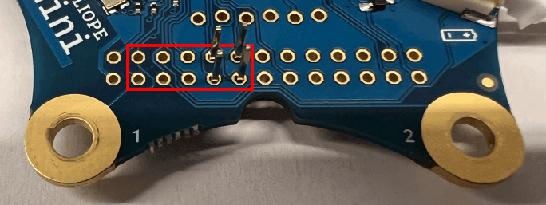

If you only want to use the ultrasonic sensor and no other sensors together with alligator jump wire, you should use the **P0 / C0** and **P3 / C3** pins instead.

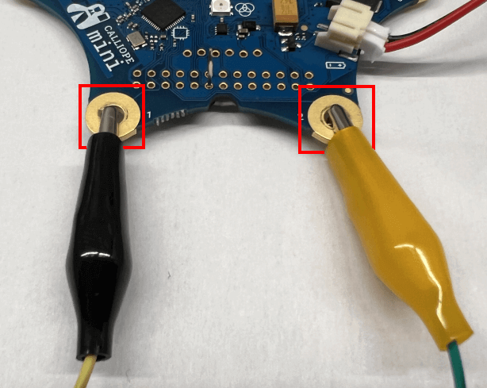

#### Trig Pin

We recommend to use the pin **P0 / C0** or **C8** for the Trig signal.

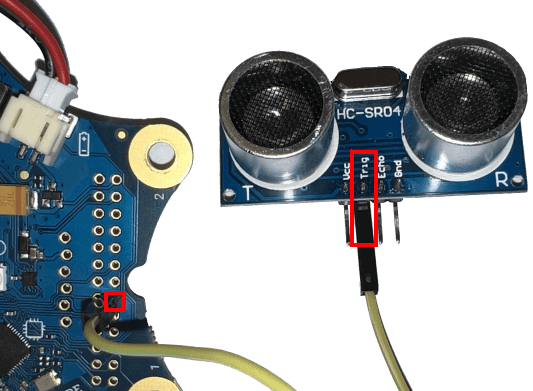

#### Echo Pin

We recommend to use the pin **P3 / C3** or **C9** for the echo signal.

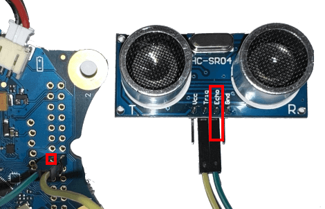

#### VCC (Voltage) Pin and GND (Ground) Pin

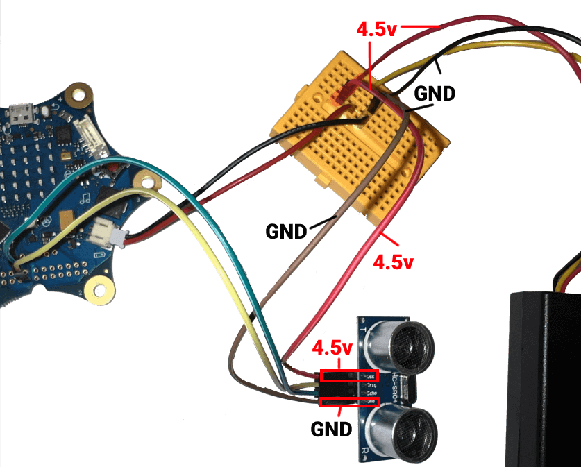

### 2. Pin Configuration for Trig pin and Echo pin

Before we could start using the ultrasonic sensor, we first need to configure it inside the **robot configuration** tab.

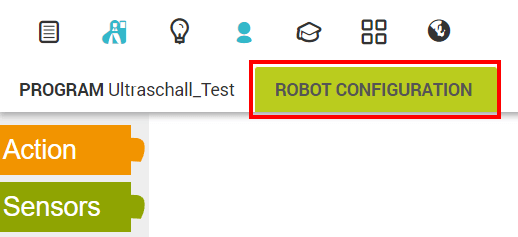

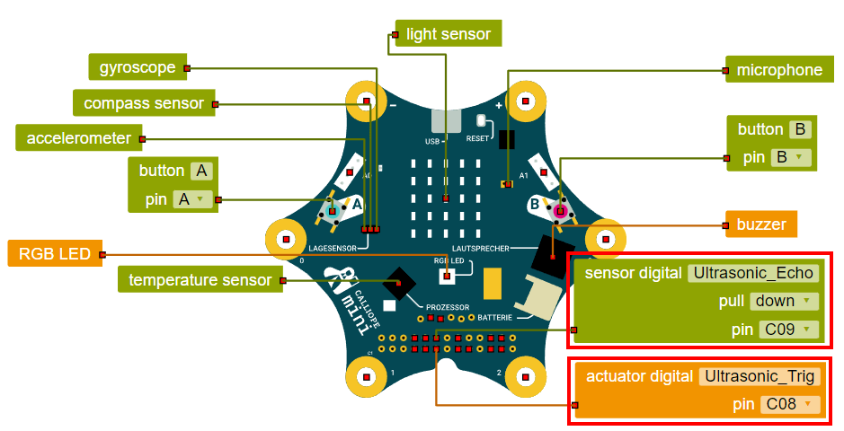

### Echo Pin configuration

For the echo pin you need to use the **actuator digital block** from the **Action section**.

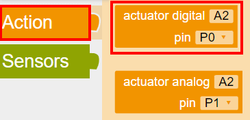

Move the block to the Calliope Mini and change the port to **P0 / C0** or **C08** or the port you have chosen for your project.

### Trig Pin configuration

For the trig pin you need to use **sensor digital block** from the **Sensors section**.

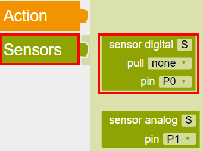

Move the block to the Calliope Mini and change the port to **P3 / C3** or **C09** or the port you have chosen for your project.
Furthermore you should change the pull option to down, if this cause any problems switch to none instead.

### 3. Example Program

In the last step we are writing a small program which will read out the distance and is display it on the LED screen.

#### a.) Define a variable for the distance

In the first step we are adding a variable named "Distance" with the default value of **0**.
To add a variable just click on the **+** symbol inside the start block.

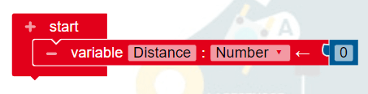

#### b.) Add a infinite loop

To measure and display the distance the sensors need to repeat the process several time.
The easiest way is to add an the **repeat indefinitely block** from the **Control section** to repeat the same actions over and over again.

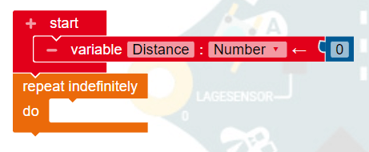

#### c.) Set the trig pin HIGH for about 10µs

The Calliope Mini is fast, but not fast enough to send a signal for just 10µs for this reason we are using 1ms instead to let the Calliope Mini enough time to process our actions.

First of all you need to switch to the advanced tab to use the **write digital block** from the **Action -> Pin section** and the **wait ms block** from the **Control -> Wait section**.

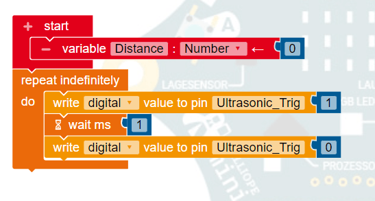

#### d.) Read the pulse time from the echo pin and calculate the distance

After we set the **trig** pin **HIGH** and back to **LOW** we need to check if we received any echo.
For this reason we are using the **get analog value block** from the **Sensors section** and adjusting the **analog value** to **pulse time HIGH** instead with your corresponding **echo** port.

We additional convert the value to distance in centimeters and store the result in the Distance variable.

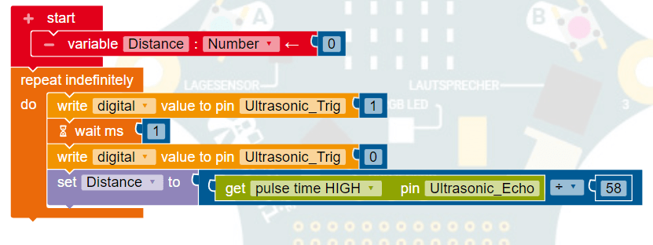

#### e.) Switch off/on the LED matrix

You can skip this step if you are using pin **P0 / C0** and **P3 / C3** for connecting the ultrasonic sensor.

Most of the pins are shared with other on-board devices, like the LED matrix display.
To make sure we avoid any possible side effects or flickering, we need disable and re-enable the LED matrix after the reading of the value digital value from the **echo** pin.

For this reason we move the **switch LED matrix block** from the **Actions -> Pin section** after the reading and set it to "off" and "on" to re-enable the display.

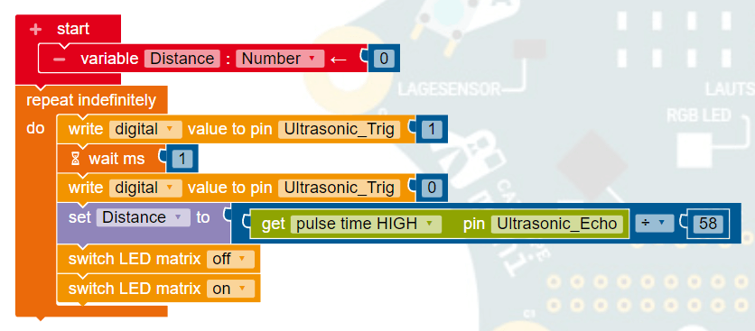

#### f.) Show the distance

In the next step we are displaying the result of the Distance variable on the LCD screen over the **show text block** from the **Action -> Display** section.

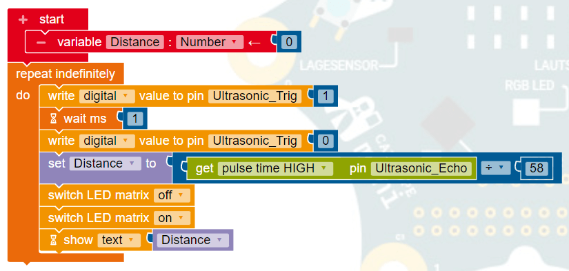

#### g.) Delay execution

To lower the power consumption, temperature and cpu usage of your program, it's a good idea to delay the execution by 500ms or with the **wait ms block** from the **Control -> Wait section**.

For most use-cases it's not need to read the distance every 1ms, maybe every 10ms or 100ms.

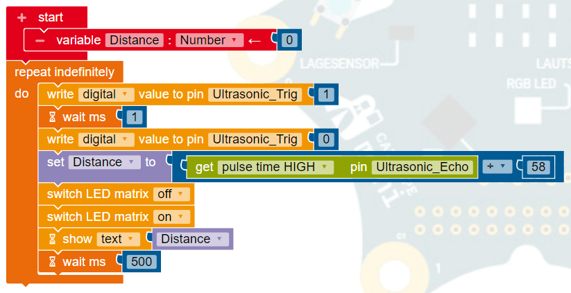

### Done

You successfully connected a ultrasonic HC-SR04 sensor to your Calliope Mini to display the measured distance.

[open_roberta_lab]: https://lab.open-roberta.org/
