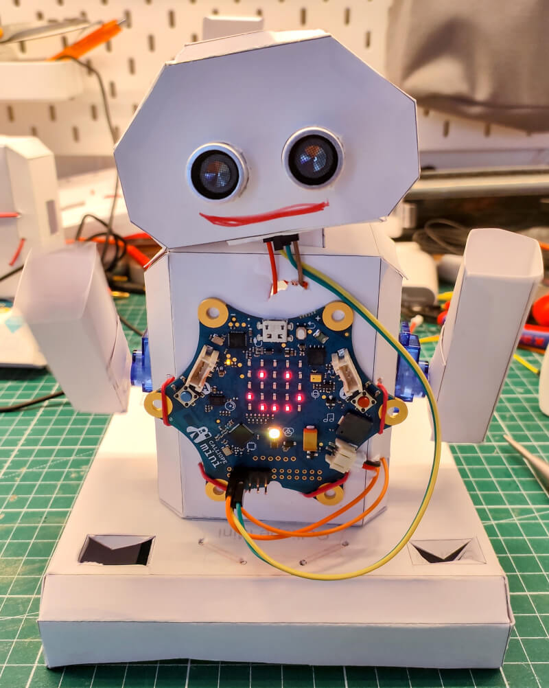

# Paper Robot

The paper robot is an easy to build but functional robot for the Calliope Mini.
The intention was to construct a low-cost robot which use most of the more common components instead of expensive and hard to get components.

## Requirements

### Hardware Components

The following hardware components are required for this paper robot.

| Name                                                                                                | Quantity |
| --------------------------------------------------------------------------------------------------- | -------- |
| 4.5V-5V power source like the [Battery Box with 3V and 4.5V power](/hardware/battery_box/README.md) | x 1      |
| Breadboard                                                                                          | x 1      |
| Jump wire female-female                                                                             | x 4      |
| Jump wire female-male                                                                               | x 6      |
| Jump wire male-alligator clips                                                                      | x 2      |
| Jump wire female-alligator clips                                                                    | x 2      |
| Jump wire male-male                                                                                 | x 4      |
| Micro JST PH 2.0 2-Pin Connector (with cable)                                                       | x 1      |
| Micro Servo SG90                                                                                    | x 2      |
| Paper min. 300g/m² or normal paper and card board                                                   | x 4      |
| Ultrasonic HC-SR04 Sensor                                                                           | x 1      |
| Rubber band (min ~70mm ⌀)                                                                           | x 2      |
| Optional: Additional jump wire in different colors                                                  | x 1      |
| Optional: Sticker for decoration                                                                    | x 1      |
| Optional: Two row pin header (2,54mm distance, 5 x 2)                                               | x 1      |

### Hand tools

The following hand tools are needed.

| Name                                                              | Quantity |
| ----------------------------------------------------------------- | -------- |
| Scissors                                                          | x 1      |
| Cutter with corresponding cutting mat                             | x 1      |
| Coloured pencils                                                  | x 1      |
| Craft glue                                                        | x 1      |
| Optional: Transparent multifunctional adhesive tape for repairing | x 1      |

### Other tools

The following additional tools are needed.

| Name                                   | Quantity |
| -------------------------------------- | -------- |
| Printer to print the template on paper | x 1      |

## Building Time - Papercraft

Cutting, bending and glueing the different parts takes some time and should not be under estimated.

| Part                        | Avg Time | Avg Time with pre-cutting |
| --------------------------- | -------- | ------------------------- |
| [Base Part](base/README.md) | 25min    | 15min                     |
| [Body Part](body/README.md) | 20min    | 15min                     |
| [Head Part](head/README.md) | 25min    | 15min                     |
| [Arms Part](arms/README.md) | 15min    | 10min                     |

If you using this project for an class room training, I recommend considering following points to minimize the work time:

- Build teams with two person per paper robot, so that they could work in parallel.
- Pre-cut hard parts with an cutter.
- Use a prick punch for the wholes.
- Make sure that the used glue is not take ages to try.

## Variants

The paper bot could be build in two different kind of versions, for schools or for the start I recommend using the basic version.

### Basic Version

The basic versions is using the standard pins P0-P3 for connecting the different kind of components.
This has the advancement that the LED screen and other on-board components are working without workarounds.
The down side is that the visible standard pins P0-P3 could not be used for any other propose.

### Advanced Version

The advanced versions is using on-board pins which are shared with other onboard components of the board.
This has the advancement that the standard pins P0-P3 could be still used for other use-cases.
The down side is that there will be a limitations with internal components like the 5x5 LED Matrix which requires specific workarounds.
