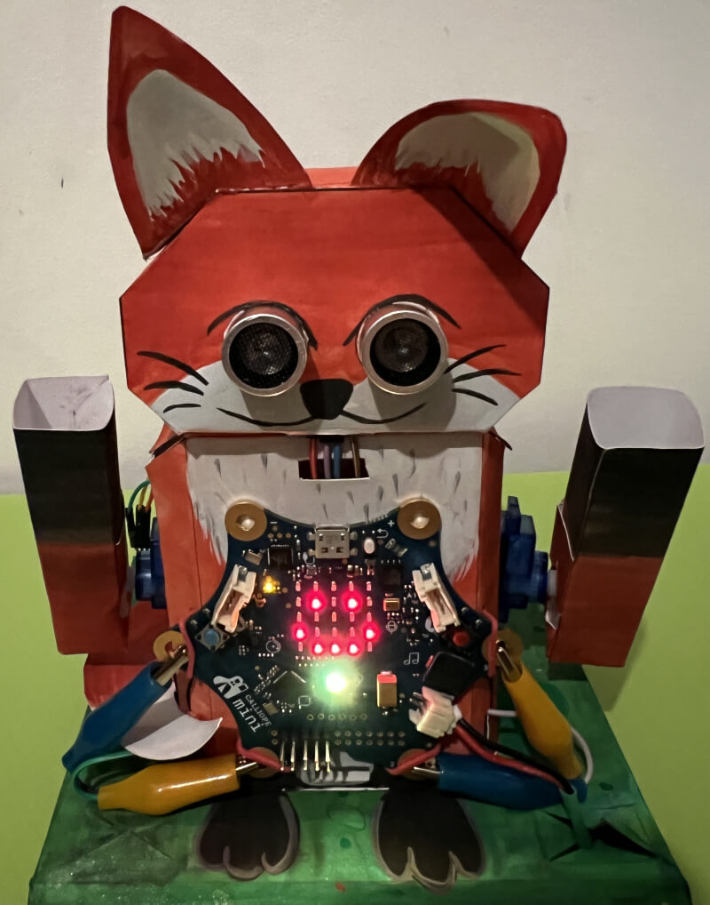
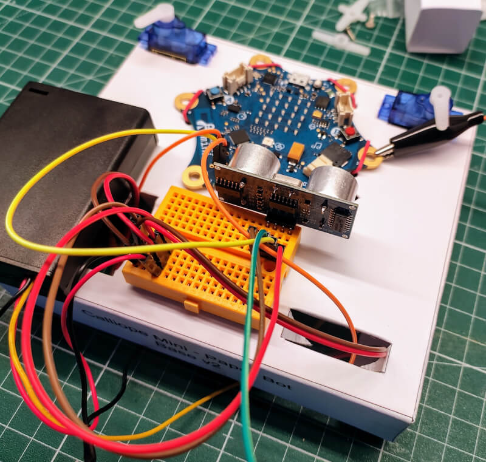
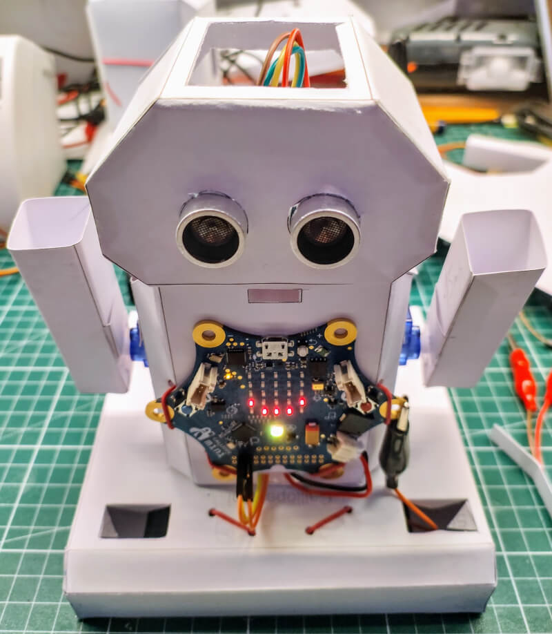
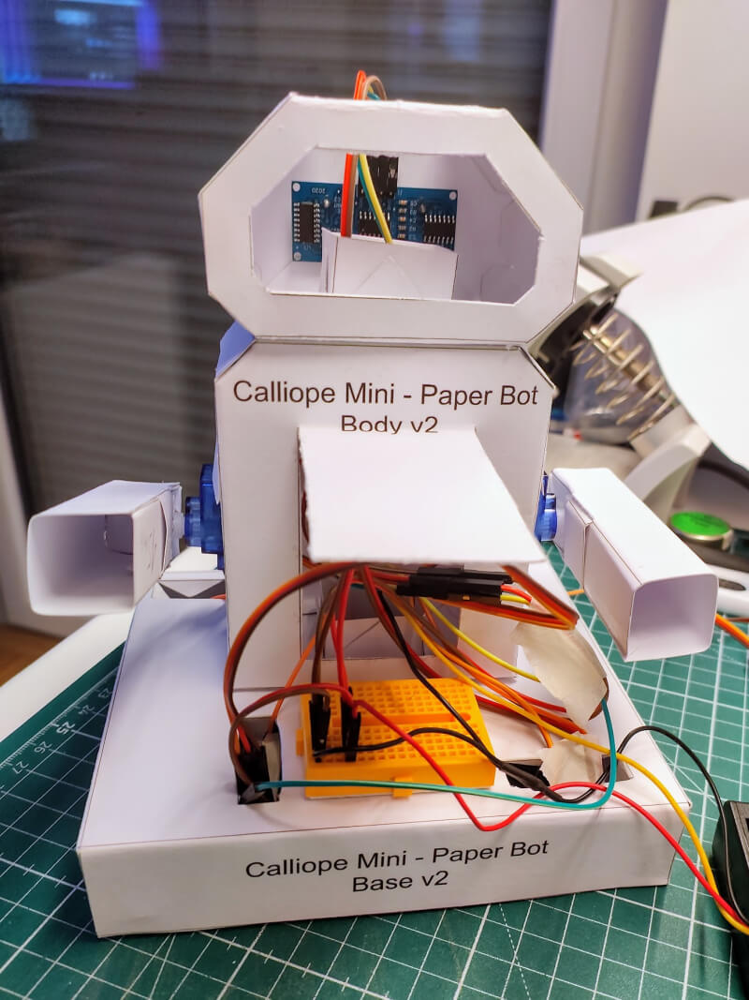
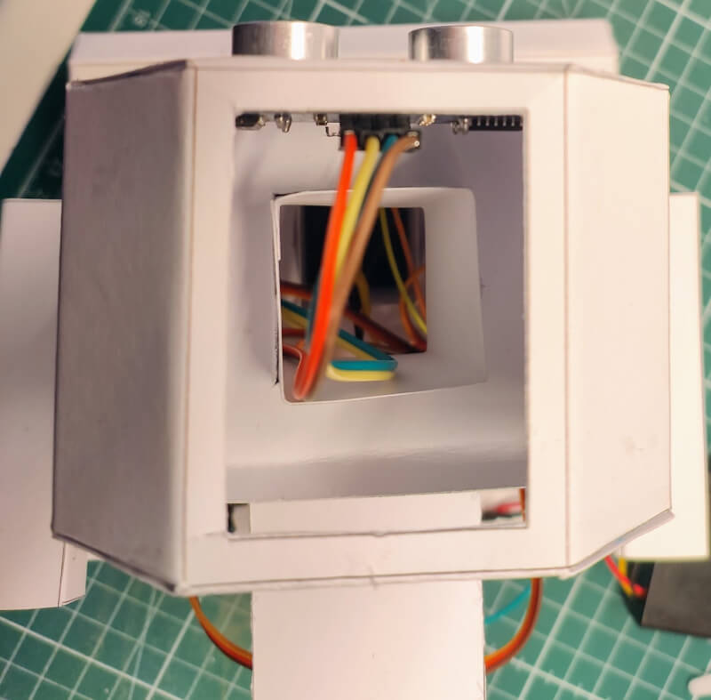
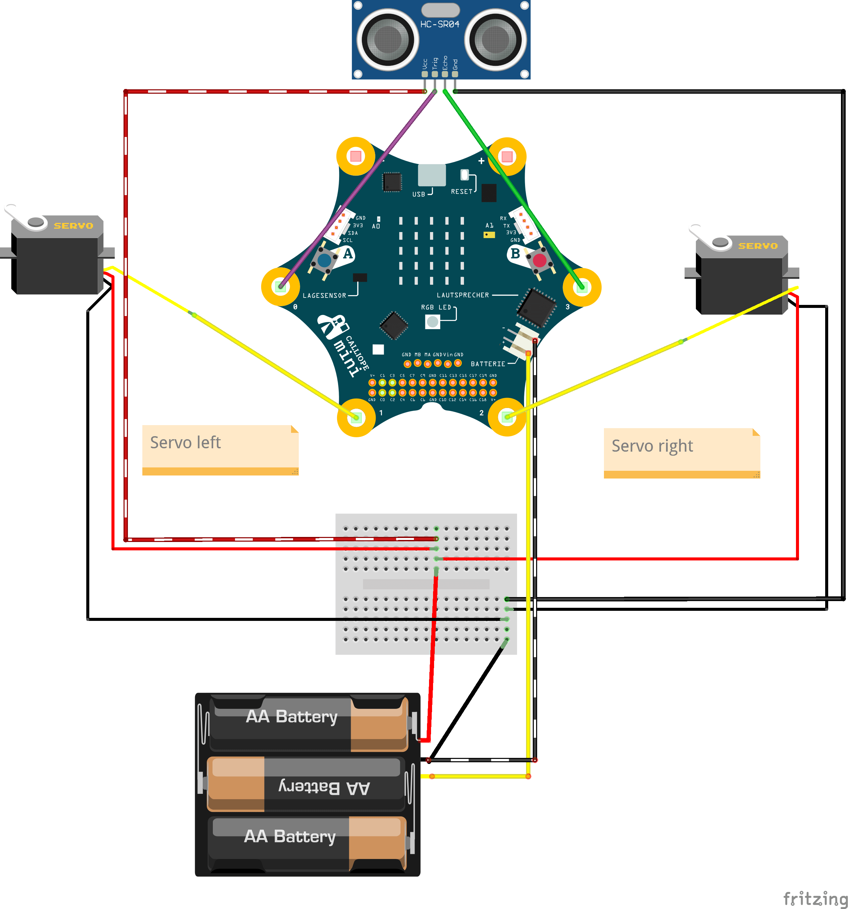
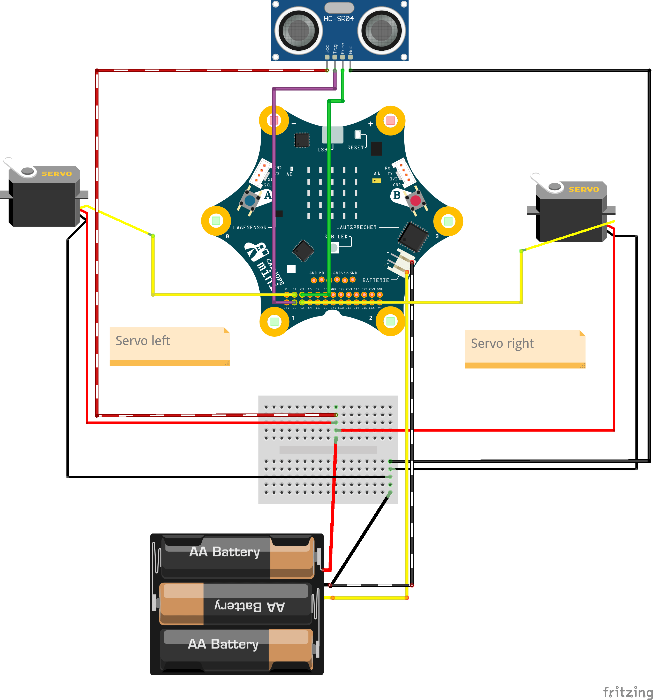

# Paper Robot

The paper robot is an easy to build but functional robot for the Calliope Mini.
The intention was to construct a low-cost robot which use most of the more common components instead of expensive and hard to get components.

## Requirements

### Hardware Components

The following hardware components are required for this paper robot.

| Name                                                                                                | Quantity |
| --------------------------------------------------------------------------------------------------- | -------- |
| 4.5V-5V power source like the [Battery Box with 3V and 4.5V power](/hardware/battery_box/README.md) | x 1      |
| Breadboard                                                                                          | x 1      |
| Jump wire female-female                                                                             | x 4      |
| Jump wire female-male                                                                               | x 6      |
| Jump wire male-alligator clips                                                                      | x 2      |
| Jump wire female-alligator clips                                                                    | x 2      |
| Jump wire male-male                                                                                 | x 4      |
| Micro JST PH 2.0 2-Pin Connector (with cable)                                                       | x 1      |
| Micro Servo SG90                                                                                    | x 2      |
| Paper min. 300g/m² or normal paper and card board                                                   | x 4      |
| Ultrasonic HC-SR04 Sensor                                                                           | x 1      |
| Rubber band (min ~70mm ⌀)                                                                           | x 2      |
| Optional: Additional jump wire in different colors                                                  | x 1      |
| Optional: Sticker for decoration                                                                    | x 1      |
| Optional: Two row pin header (2,54mm distance, 5 x 2)                                               | x 1      |

### Hand tools

The following hand tools are needed.

| Name                                                              | Quantity |
| ----------------------------------------------------------------- | -------- |
| Scissors                                                          | x 1      |
| Cutter with corresponding cutting mat                             | x 1      |
| Coloured pencils                                                  | x 1      |
| Craft glue                                                        | x 1      |
| Optional: Transparent multifunctional adhesive tape for repairing | x 1      |

### Other tools

The following additional tools are needed.

| Name                                   | Quantity |
| -------------------------------------- | -------- |
| Printer to print the template on paper | x 1      |

## Building Process

The building process is separated into the papercraft part, testing part and final building part.

### Papercraft

Cutting, bending and glueing the different parts takes some time and should not be under estimated.
I recommending building the different parts in the listed order to make sure that the base parts are try to the start.

| Part                        | Avg Time | Avg Time with pre-cutting |
| --------------------------- | -------- | ------------------------- |
| [Base Part](base/README.md) | 25min    | 15min                     |
| [Body Part](body/README.md) | 20min    | 15min                     |
| [Head Part](head/README.md) | 25min    | 15min                     |
| [Arms Part](arms/README.md) | 15min    | 10min                     |

If you using this project for an class room training, I recommend considering following points to minimize the work time:

- Build teams with two person per paper robot, so that they could work in parallel.
- Pre-cut hard parts with an cutter.
- Use a prick punch for the wholes.
- Make sure to use a glue which is not take ages to try.

### Variants

The paper bot could be build in two different kind of versions, for schools or for the start I recommend using the basic version.

#### Basic Version

The basic versions is using the standard pins P0-P3 for connecting the different kind of components.
This has the advancement that the LED screen and other on-board components are working without workarounds.
The down side is that the visible standard pins P0-P3 could not be used for any other propose.

##### Connection Pins

The following pins are used for the different kind of sensors and actors for the basic version.

| Name                     | Device Pin | Calliope Mini Pin | Battery Pack |
| ------------------------ | ---------- | ----------------- | ------------ |
| Micro Servo SG90 (left)  | GND ⏚      | -                 | GND ⏚        |
| Micro Servo SG90 (left)  | SIGNAL 🦾  | P1 /C1 🟠         | -            |
| Micro Servo SG90 (left)  | VCC ⚡     | -                 | 5V ⚡        |
| Micro Servo SG90 (right) | GND ⏚      | -                 | GND ⏚        |
| Micro Servo SG90 (right) | SIGNAL 🦾  | P2 /C2 🟠         | -            |
| Micro Servo SG90 (right) | VCC⚡      | -                 | 5V ⚡        |
| Ultrasonic HC SR04       | GND ⏚      | -                 | GND ⏚        |
| Ultrasonic HC SR04       | TRIG 🕪     | P0 /C0 🟡         | -            |
| Ultrasonic HC SR04       | ECHO 🎤    | P3 /C3 🟢         | -            |
| Ultrasonic HC SR04       | VCC ⚡     | -                 | 5V ⚡        |

#### Advanced Version

The advanced versions is using on-board pins which are shared with other onboard components of the board.
This has the advancement that the standard pins P0-P3 could be still used for other use-cases.
The down side is that there will be a limitations with internal components like the 5x5 LED Matrix which requires specific workarounds.

## Testing

Before building the final robot you should make sure to follow the testing part of the [Base Part](base/README.md).
The base is ideal for testing your program with the micro servo and ultra sonic sensor before assembling the final robot.

## Building Part

After you prepared all parts and successful tested your program, you can assemble the final robot.
You just need to use the two connector blocks to mount the body to the base and the head to the body.
If you want to glue the connectors you should glue them only into the body part.
This make sure that you could still easily use the base for testing or adjusting the head, if needed.

### Body

The body has several cable opening to allow an easy cable management to avoid that cables are in the way of the moving servos.

### Head

The head allows the mounting of the ultra sonic sensor in two directions, if needed you can extend the jump wires and using the connection blocks for the cables.

### Arms

The arms are open in the front, which allows to build tools or other accessory for them.

## Wiring Part

The final wiring for the two micro servo sg90 and the ultra sonic hc-sr04 sensor should look like the following.

You don't need to use exact the same colors for the wiring, but you should make sure to use different kind of colors to not get confused yourself with the wiring at any time.

### Connection Pads Wiring

If you are using the connection pads, your wiring should look like this.

### Connection Pin Header Wiring

If you are using the connection pin header, your wiring should look like this.

