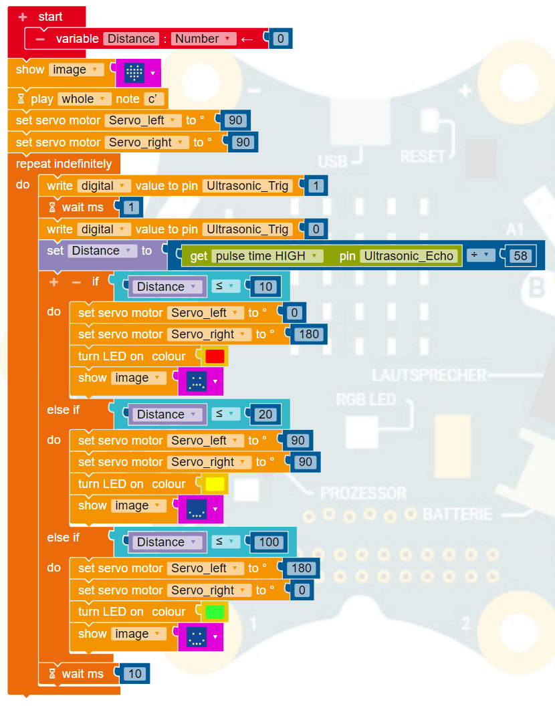

# Paper Robot - Base

## Papercraft

The average building time for cutting, bending and glueing will take about 25min.

📄 [Paper Bot - Base v2.pdf](papercraft/Paper%20Bot%20-%20Base%20v2.pdf)

## Testing

The base is ideal for testing your components and your program before moving to the final assembly.

You could easily place the breadboard, ultrasonic sensor and the servos together with the Calliope Mini Board for testing.

## Connection Pins

The following pins are used for the different kind of sensors and actors.

| Name                     | Device Pin | Calliope Mini Pin | Battery Pack |
| ------------------------ | ---------- | ----------------- | ------------ |
| Micro Servo SG90 (left)  | GND ⏚      | -                 | GND ⏚        |
| Micro Servo SG90 (left)  | SIGNAL 🦾  | P1 /C1 🟠         | -            |
| Micro Servo SG90 (left)  | VCC ⚡     | -                 | 5V ⚡        |
| Micro Servo SG90 (right) | GND ⏚      | -                 | GND ⏚        |
| Micro Servo SG90 (right) | SIGNAL 🦾  | P2 /C2 🟠         | -            |
| Micro Servo SG90 (right) | VCC⚡      | -                 | 5V ⚡        |
| Ultrasonic HC SR04       | GND ⏚      | -                 | GND ⏚        |
| Ultrasonic HC SR04       | TRIG 🕪     | P0 /C0 🟡         | -            |
| Ultrasonic HC SR04       | ECHO 🎤    | P3 /C3 🟢         | -            |
| Ultrasonic HC SR04       | VCC ⚡     | -                 | 5V ⚡        |

## Example Program

The following program could be used for a simple test to see if everything works correct.

